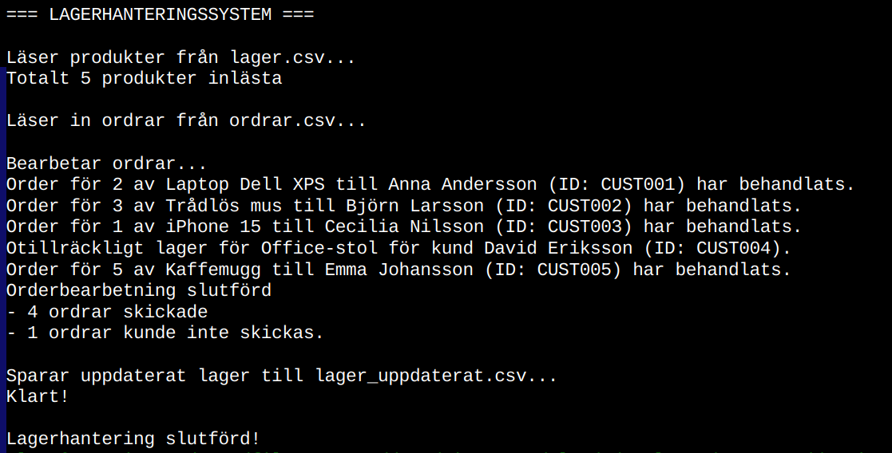

# assignment-oop-81clafra - Claes Fransson

**Valt alternativ:** Lagerhanteringssystem

## Projektbeskrivning

För den här inlämningsuppgiften i kursen _Grundläggande objektorienterad programmering i C#_ på _Yrkeshögskolan campus Mölndal_ valde jag alternativet _"Lagerhanteringssystem"_. 
Programmet läser från datafiler in aktuellt lagersaldo och inkomna ordrar, behandlar ordrarna, och skriver sedan ut ett uppdaterat lagersaldo till fil.

## Screenshot


_Exempel på utskrift vid en enstaka körning av programmet_

## Hur man startar programmet

### Förutsättningar

- .NET 9.0 eller senare
- En av följande utvecklingsmiljöer: Visual Studio, JetBrains Rider, Visual Studio Code, eller terminal/kommandotolk

### Klona projektet

```bash
git clone https://github.com/orgs/Campus-Molndal-CLO25/repositories/assignment-oop-81clafra
cd assignment-oop-81clafra
```

### Starta programmet

#### Visual Studio

1. Öppna `assignment-oop-81clafra.sln` eller projektmappen
2. Tryck `F5` eller klicka på "Start" (grön triangel)

#### JetBrains Rider

1. Öppna projektmappen genom "File → Open"
2. Tryck `Ctrl+F5` eller klicka på "Run" (grön triangel)

#### Visual Studio Code

1. Öppna projektmappen: `code .`
2. Installera C# Dev Kit-tillägget om det saknas
3. Tryck `F5` eller använd "Run → Start Debugging"

#### Terminal/Kommandotolk

```bash
cd OOPAssignment
dotnet run
```

Placera filen för lagersdata, `lager.csv`, och filen med ordrar, `ordrar.csv`, i samma katalog som 
du kör programmet. 

## Hur man använder programmet

Spara din data för lager och ordrar i comma-separated values-filer enligt format nedan:

### lager.csv

```
Name,Category,Price,Quantity
Laptop Dell XPS,Electronics,15999.00,12
Trådlös mus,Electronics,299.00,45
iPhone 15,Electronics,12999.00,8
Office-stol,Furniture,2499.00,6
Kaffemugg,Kitchen,79.00,50
```

### ordrar.csv

```
CustomerId,CustomerName,ProductName,QuantityOrdered
CUST001,Anna Andersson,Laptop Dell XPS,2
CUST002,Björn Larsson,Trådlös mus,3
CUST003,Cecilia Nilsson,iPhone 15,1
CUST004,David Eriksson,Office-stol,15
CUST005,Emma Johansson,Kaffemugg,5
```

## Funktioner

### Grundfunktioner

- [x] Läsa lagerdata
- [x] Bearbeta kundordrar
- [x] Spara uppdaterat lager

## Projektstruktur

```
assignment-oop-81clafra/
├── OOPAssignment/
│   ├── Program.cs          # Huvudprogram
│   ├── InventoryManager.cs # Klasser
│   ├── Order.cs
│   ├── Product.cs
│   ├── lager.csv           # Datafiler
│   └── ordrar.csv
├── README.md               # Denna fil
├── reflection.md           # Reflektion över projektet
└── LICENSE
```

## Teknisk information

- **Programmeringsspråk:** C#
- **Framework:** .NET 9.0
- **Utvecklingsmiljö:** Visual Studio Code / Fedora Linux


## Länkar

- **GitHub Repository:** https://github.com/orgs/Campus-Molndal-CLO25/repositories/assignment-oop-81clafra

---

_Skapad som del av kursen "Grundläggande objektorienterad programmering i C#" vid Yrkeshögskolan Campus Mölndal._
